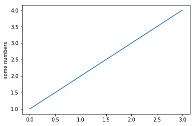

```python
#plot([1,2,3], [1,2,3], 'go-', label='line 1', linewidth=2)
#plot([1,2,3], [1,4,9], 'rs',  label='line 2')
```


```python
%matplotlib inline 
import matplotlib.pyplot as plt
plt.plot([1,2,3,4])
plt.ylabel('some numbers')
plt.show()
```





```python

```
